# elasticsearch (一)

## 介绍

Elasticsearch 是一个分布式可扩展的实时搜索和分析引擎，一个建立在全文搜索引擎 Apache Lucene(TM) 。

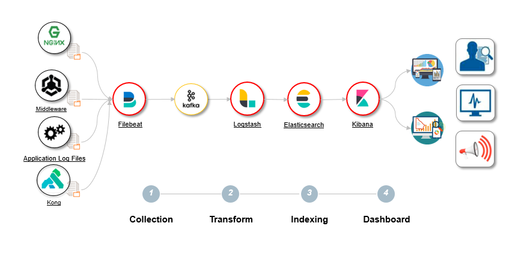

## 基本概念与MySQL的对比

| ElasticSearch         | MySQL    |
| --------------------- | -------- |
| Index                 | Database |
| Type (未来将删除)     | Tabl     |
| Document              | Row      |
| Field                 | Column   |
| Mapping               | Schema   |
| Everything is indexed | Index    |
| Query DSL             | SQL      |
| GET HTTP              | SELECT   |
| PUT HTTP              | UPDATE   |

**ElasticSearch对比Solr**

- Solr利用 Zookeeper 进行分布式管理，而ElasticSearch自身带有分布式协调管理功能;
- Solr支持更多格式的数据，而ElasticSearch仅支持Json文件格式；
- Solr官方提供的功能更多，而ElasticSearch本身更注重于核心功能，高级功能多由第三方插件提供；
- Solr在传统的搜索应用中表现好于ElasticSearch，但在处理实时搜索应用时效率明显低于ElasticSearch


## 结构

### 倒排索引项

- 文档_id；
- 词频TF：token在文档中出现的次数，用于相关性评分；
- 位置Position：token在文档中分词的位置，用于match_phrase类型的查询；
- 偏移量Offset：记录token开始和结束的位置，实现高亮显示。

### 创建倒排索引

对文档内容进行分词，形成一个个token（可以理解为单词），保存token和文档_id之间的关系。

### 检索倒排索引

先对检索内容进行分词（适用于match查询方法，term/terms查询不分词），然后在倒排索引中寻找匹配的token，最后返回token对应的文档以及根据文档中token匹配情况给出的评分score。

### 分词器Analyzer

在Elasticsearch中可通过内置分词器实现分词，也可以按需定制分词器。
Analyzer由三部分组成：

- Character Filters：原始文本处理，它的作用是整理字符串。如去除HTML，或者将&转化为and；
- Tokenizer：按照规则切分为单词。比如whitespace的分词器在遇到空格和标点的时候，可能会将文本进行拆分；
- Token Filters：对切分单词加工，如小写（lowercase token filter）、删除a，and和the等stopwords（stop token filter），增加同义词（synonym token filter）等。

利用ElasticSearch提供的webAPI可以查看索引中某一字段field对文本text的分词策略：

```http
POST /[index]/_analyze
{
  "field": [field],
  "text": [text]
}
```

## 建立索引和类型

- 在Elasticsearch集群中，节点是对等的，节点间会通过自己的一些规则选取集群的Master，Master节点会负责集群状态信息的改变，并同步给其他节点。
- 建立索引和类型的请求先发送到Master节点，Master建立完索引后，将集群状态同步至Slave节点。
- 只有建立索引和类型需要经过Master节点，数据的写入有一个简单的Routing规则，可以Route到集群中的任意节点，所以数据写入压力是分散在整个集群的。

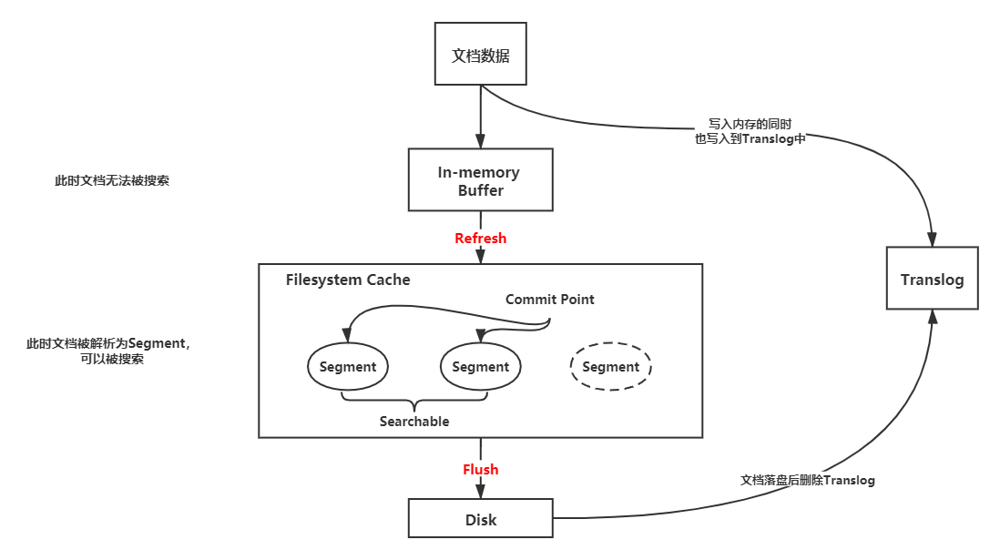

- In-memory Buffer
  在主分片节点上，文档会先被写入到内存（In-memory Buffer）中，此时数据还不能被搜索到。
- Refresh
  经过一段时间（refresh_interval）或者内存缓冲满了，Elasticsearch会将内存中的文档Refresh到文件系统缓存（Filesystem Cache）中，并清除内存中的对应文档。
- Filesystem Cache
  文档在文件系统缓存中被解析为Lucene的底层文件Segment中，同时建立倒排索引。这个时候文档是可以被搜索到的，因此减少了后续写入磁盘的大量时间，体现了Elasticsearch搜索的实时性（下图中的绿色和灰色图标分别代表已写入磁盘和未写入磁盘的文档）。

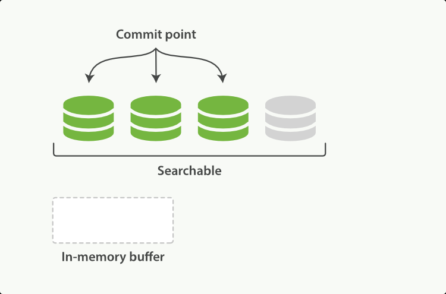

- Segment
  Lucene把每次生成的倒排索引，叫做一个段(Segment)，它无法被修改，只能被合并和删除。另外使用一个Commit文件，记录索引内所有的Segment。由于每次打开一个Segment就会消耗一个文件句柄，随着Segment越来越多，将导致查询性能越来越差。这时，ElasticSearch后台会有一个单独线程专门合并Segment，将零碎的小的Segment合并成一个大的Segment。

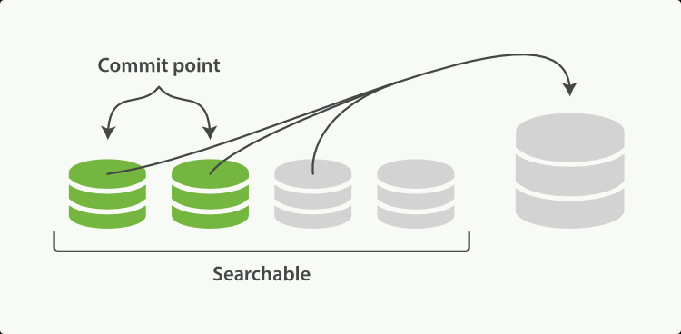

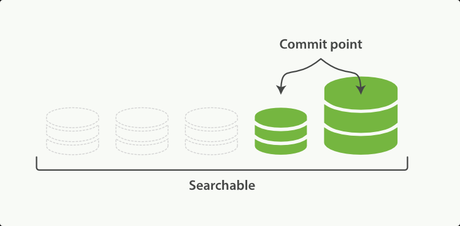

- Flush
  将Segment写入磁盘中，更新Commit文件并删除文档对应的Translog文件。
- Translog
  Elasticsearch在把数据写入到Index Buffer的同时，其实还另外记录了一个Translog日志。它是以顺序写文件的形式写入到磁盘中的，速度较快。如果发生异常，Elasticsearch会从Commit位置开始，恢复整个Translog文件中的记录，保证数据一致性。

## 多个分片的文档写入

### 确定文档存储位置

计算方式：

> shard = hash(routing) % number_of_primary_shards

每个文档都有一个routing参数，默认情况下就使用其 _id 值。将其 _id 值计算哈希后，对索引的主分片数取余，就得到了文档实际应该存储到的分片。因此索引的主分片数不可以随意修改，一旦主分片数改变，所有文档的存储位置计算结果都会发生改变，索引数据就完全不可读了。

### 同步副本

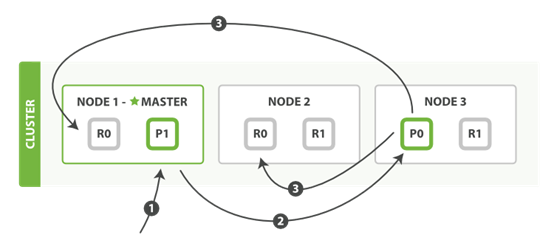

1. 客户端请求发送给Node 1节点，注意图中Node 1是Master节点，实际完全可以不是；
2. Node 1用文档的 _id 取余计算得到应该将数据存储到shard 0上。通过Cluster State信息发现shard 0的主分片已经分配到了Node 3上。Node 1转发请求数据给Node 3；
3. Node 3完成请求数据的索引过程，存入主分片 0。然后并行转发数据给分配有shard 0的副本分片的Node 1和Node 2。当收到任一节点汇报副本分片数据写入成功，Node 3即返回给初始的接收节点 Node 1，宣布数据写入成功。Node 1返回成功响应给客户端；
4. 当集群中某个节点宕机，该节点上所有分片中的数据全部丢失（既有主分片，又有副分片）。丢失的副分片对数据的完整性没有影响，丢失的主分片在其他节点上的副分片会被选举成主分片；所以整个索引的数据完整性没有被破坏。

注：图中P代表主分片（Primary Shard），R代表副本（Replica Shard）。

## 根据_id查询文档

```http
GET /[index]/_doc/[_id]
```

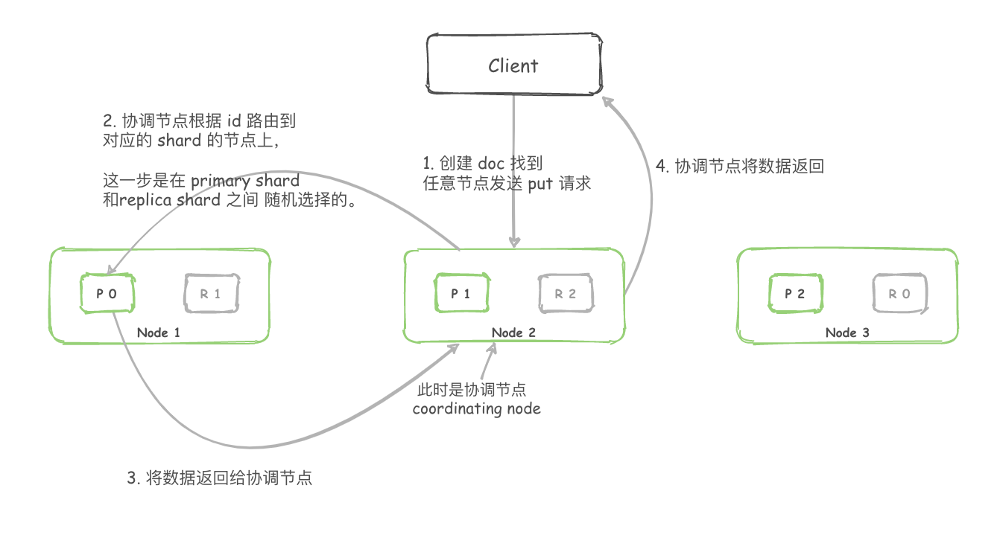

1. Elasticsearch集群中的任意节点都可以作为协调（Coordinating）节点接受请求，每个节点都知道集群中任一文档位置；
2. 协调节点对文档的_id进行路由，从而判断该数据在哪个Shard，然后将请求转发给对应的节点，此时会使用随机轮询算法，在Primary Shard和Replica Shard中随机选择一个，从而对请求负载均衡；
3. 处理请求的节点返回文档给协调节点；
4. 协调节点返回文档给客户端。

## 根据字段值检索数据

```http
GET /[index]/_search?q=[field]: [value]
```

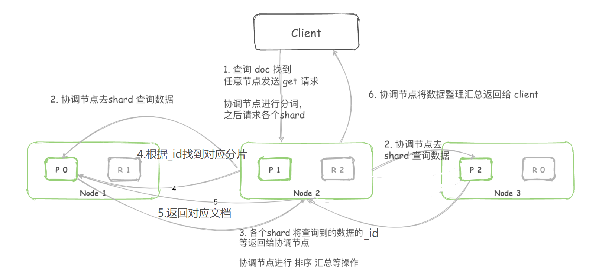

1. Elasticsearch集群中的任意节点都可以作为协调（Coordinating）节点接受请求，每个节点都知道集群中任一文档位置；
2. 协调节点进行分词等操作后，向所有的shard节点发送检索请求；
3. ElasticSearch已建立字段的倒排索引，即可通过字段值检索到所在文档的_id。随后Shard将满足条件的数据（_id、排序字段等）信息返回给协调节点;
4. 协调节点将数据重新进行排序，获取到真正需要返回的文档的_id。协调节点再次向对应的Shard发起请求（此时已经有_id 了，可以直接定位到对应的Shard）;
5. Shard将_id对应的文档的完整内容返回给协调节点；
6. 协调节点获取到全部检索结果，返回给客户端。

上述流程和根据_id查询文档相比，只是多了一个从倒排索引中根据字段值寻找文档_id的过程，其中的4~6步与其完全相同。


同一个索引下，分布在多个节点里的称为分片——Shard。

一个 Shard 本质上是一个 Lucene Index，一个lucene索引最大包含2,147,483,519 (= Integer.MAX_VALUE - 128)个文档数量。

**Mini 索引：Segment**

一个Lucene索引包含多个segments，一个segment包含多个文档，每个文档包含多个字段，每个字段经过分词后形成一个或多个term。

Lucene索引文件结构主要分为：词典、倒排表、正向文件、DocValues等，如下图：

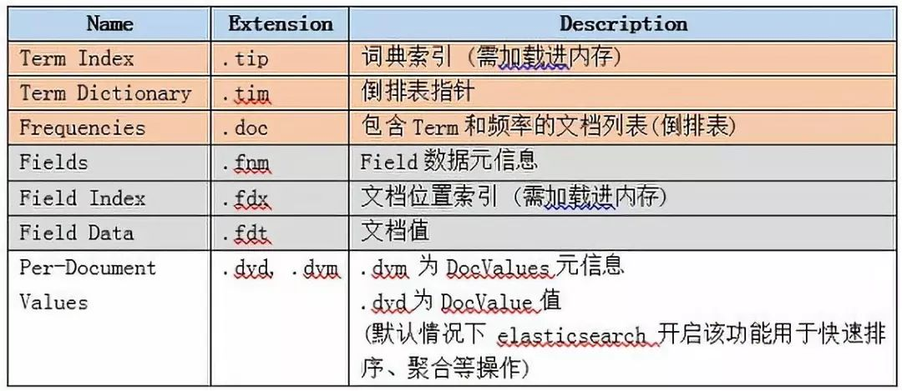

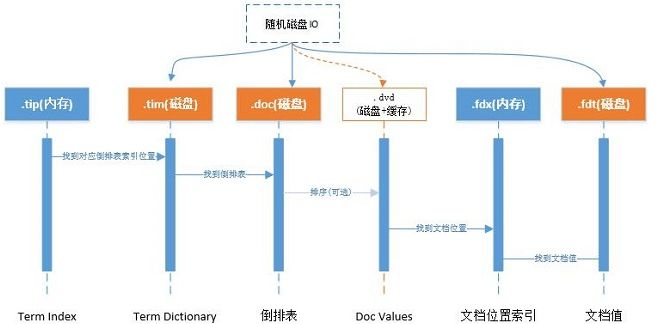

Lucene  中的核心术语:

Term：是索引里最小的存储和查询单元，对于英文来说一般是指一个单词，对于中文来说一般是指一个分词后的词。

词典（Term Dictionary，也叫作字典）：是 Term 的集合。词典的数据结构可以有很多种，每种都有自己的优缺点。

比如：排序数组通过二分查找来检索数据：HashMap（哈希表）比排序数组的检索速度更快，但是会浪费存储空间。

FST (finite-state transducer) 有更高的数据压缩率和查询效率，因为词典是常驻内存的，而 FST 有很好的压缩率，所以 FST 在 Lucene 的最新版本中有非常多的使用场景，也是默认的词典数据结构。

倒排序（Posting List）：一篇文章通常由多个词组成，倒排表记录的是某个词在哪些文章中出现过。

正向信息：原始的文档信息，可以用来做排序、聚合、展示等。

段（Segment）：索引中最小的独立存储单元。一个索引文件由一个或者多个段组成。在 Luence 中的段有不变性，也就是说段一旦生成，在其上只能有读操作，不能有写操作。
Lucene 的底层存储格式如下图所示，由词典和倒排序两部分组成，其中的词典就是 Term 的集合：

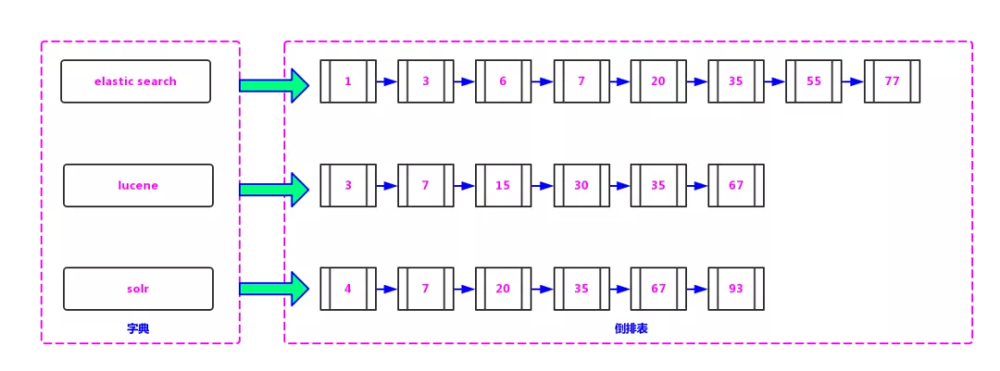

词典中的 Term 指向的文档链表的集合，叫做倒排表。词典和倒排表是 Lucene 中很重要的两种数据结构，是实现快速检索的重要基石。

词典和倒排表是分两部分存储的，在倒排序中不但存储了文档编号，还存储了词频等信息。

在上图所示的词典部分包含三个词条（Term）：Elasticsearch、Lucene 和 Solr。词典数据是查询的入口，所以这部分数据是以 FST 的形式存储在内存中的。

在倒排表中，“Lucene” 指向有序链表 3，7，15，30，35，67，表示字符串 “Lucene” 在文档编号为 3、7、15、30、35、67 的文章中出现过，Elasticsearch 和 Solr 同理。

词典中的 Term 指向的文档链表的集合，叫做倒排表。词典和倒排表是 Lucene 中很重要的两种数据结构，是实现快速检索的重要基石。

词典和倒排表是分两部分存储的，在倒排序中不但存储了文档编号，还存储了词频等信息。

在上图所示的词典部分包含三个词条（Term）：Elasticsearch、Lucene 和 Solr。词典数据是查询的入口，所以这部分数据是以 FST 的形式存储在内存中的。

在倒排表中，“Lucene” 指向有序链表 3，7，15，30，35，67，表示字符串 “Lucene” 在文档编号为 3、7、15、30、35、67 的文章中出现过，Elasticsearch 和 Solr 同理。
检索方式

在 Lucene 的查询过程中的主要检索方式有以下四种：

- 单个词查询
  指对一个 Term 进行查询。比如，若要查找包含字符串 “Lucene” 的文档，则只需在词典中找到 Term “Lucene”，再获得在倒排表中对应的文档链表即可。

- AND
  指对多个集合求交集。比如，若要查找既包含字符串 “Lucene” 又包含字符串 “Solr” 的文档，则查找步骤如下：

  在词典中找到 Term “Lucene”，得到 “Lucene” 对应的文档链表。

  在词典中找到 Term “Solr”，得到 “Solr” 对应的文档链表。

  合并链表，对两个文档链表做交集运算，合并后的结果既包含 “Lucene” 也包含 “Solr”。

- OR
  指多个集合求并集。比如，若要查找包含字符串 “Luence” 或者包含字符串 “Solr” 的文档，则查找步骤如下：

  在词典中找到 Term “Lucene”，得到 “Lucene” 对应的文档链表。

  在词典中找到 Term “Solr”，得到 “Solr” 对应的文档链表。

  合并链表，对两个文档链表做并集运算，合并后的结果包含 “Lucene” 或者包含 “Solr”。

- NOT
  指对多个集合求差集。比如，若要查找包含字符串 “Solr” 但不包含字符串 “Lucene” 的文档，则查找步骤如下：

  在词典中找到 Term “Lucene”，得到 “Lucene” 对应的文档链表。

  在词典中找到 Term “Solr”，得到 “Solr” 对应的文档链表。

  合并链表，对两个文档链表做差集运算，用包含 “Solr” 的文档集减去包含 “Lucene” 的文档集，运算后的结果就是包含 “Solr” 但不包含 “Lucene”。

  通过上述四种查询方式，我们不难发现，由于 Lucene 是以倒排表的形式存储的。

  所以在 Lucene 的查找过程中只需在词典中找到这些 Term，根据 Term 获得文档链表，然后根据具体的查询条件对链表进行交、并、差等操作，就可以准确地查到我们想要的结果。

  相对于在关系型数据库中的 “Like” 查找要做全表扫描来说，这种思路是非常高效的。

  虽然在索引创建时要做很多工作，但这种一次生成、多次使用的思路也是非常高明的。

## Lucene 查询过程

在lucene中查询是基于segment。每个segment可以看做是一个独立的subindex，在建立索引的过程中，lucene会不断的flush内存中的数据持久化形成新的segment。多个segment也会不断的被merge成一个大的segment，在老的segment还有查询在读取的时候，不会被删除，没有被读取且被merge的segement会被删除。这个过程类似于LSM数据库的merge过程。下面我们主要看在一个segment内部如何实现高效的查询。

## FST

我们就用Alice和Alan这两个单词为例，来看下FST的构造过程。首先对所有的单词做一下排序为“Alice”，“Alan”。

插入“Alan”

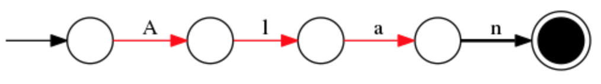

插入“Alice”

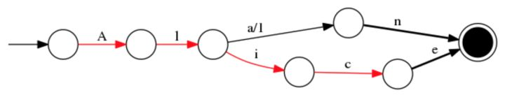

## SkipList

为了能够快速查找docid，lucene采用了SkipList这一数据结构。SkipList有以下几个特征：

1. 元素排序的，对应到我们的倒排链，lucene是按照docid进行排序，从小到大。
2. 跳跃有一个固定的间隔，这个是需要建立SkipList的时候指定好，例如下图以间隔是3
3. SkipList的层次，这个是指整个SkipList有几层

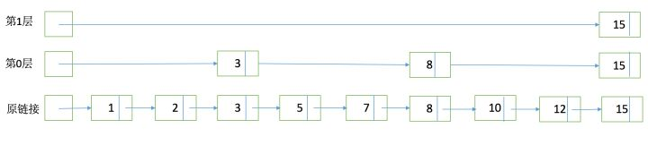

有了这个SkipList以后比如我们要查找docid=12，原来可能需要一个个扫原始链表，1，2，3，5，7，8，10，12。有了SkipList以后先访问第一层看到是然后大于12，进入第0层走到3，8，发现15大于12，然后进入原链表的8继续向下经过10和12。
有了FST和SkipList的介绍以后，我们大体上可以画一个下面的图来说明lucene是如何实现整个倒排结构的：

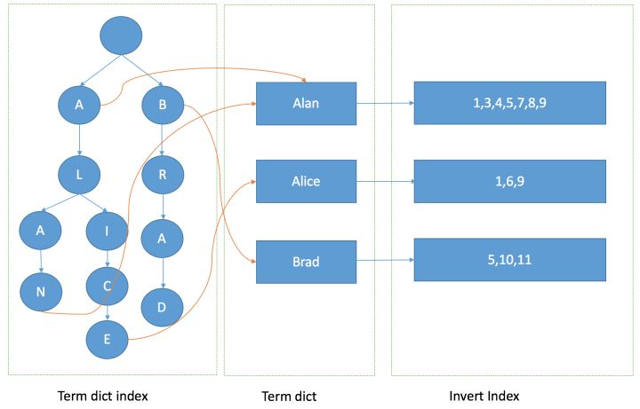

有了这张图，我们可以理解为什么基于lucene可以快速进行倒排链的查找和docid查找，下面就来看一下有了这些后如何进行倒排链合并返回最后的结果。

## 倒排合并

假如我们的查询条件是name = “Alice”，那么按照之前的介绍，首先在term字典中定位是否存在这个term，如果存在的话进入这个term的倒排链，并根据参数设定返回分页返回结果即可。这类查询，在数据库中使用二级索引也是可以满足，那lucene的优势在哪呢。假如我们有多个条件，例如我们需要按名字或者年龄单独查询，也需要进行组合 name = "Alice" and age = "18"的查询，那么使用传统二级索引方案，你可能需要建立两张索引表，然后分别查询结果后进行合并，这样如果age = 18的结果过多的话，查询合并会很耗时。那么在lucene这两个倒排链是怎么合并呢。
假如我们有下面三个倒排链需要进行合并。

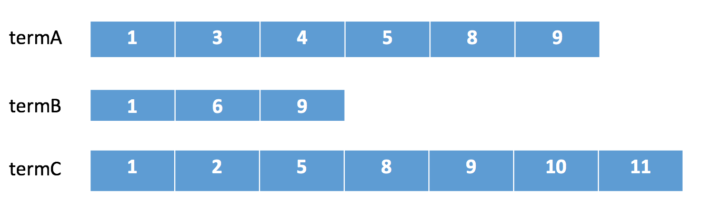

在lucene中会采用下列顺序进行合并：

 

1. 在termA开始遍历，得到第一个元素docId=1
2. Set currentDocId=1
3. 在termB中 search(currentDocId) = 1 (返回大于等于currentDocId的一个doc),
   1. 因为currentDocId ==1，继续
   2. 如果currentDocId 和返回的不相等，执行2，然后继续

4. 到termC后依然符合，返回结果

5. currentDocId = termC的nextItem

6. 然后继续步骤3 依次循环。直到某个倒排链到末尾。

整个合并步骤我可以发现，如果某个链很短，会大幅减少比对次数，并且由于SkipList结构的存在，在某个倒排中定位某个docid的速度会比较快不需要一个个遍历。可以很快的返回最终的结果。从倒排的定位，查询，合并整个流程组成了lucene的查询过程，和传统数据库的索引相比，lucene合并过程中的优化减少了读取数据的IO，倒排合并的灵活性也解决了传统索引较难支持多条件查询的问题。

## BKDTree

在lucene中如果想做范围查找，根据上面的FST模型可以看出来，需要遍历FST找到包含这个range的一个点然后进入对应的倒排链，然后进行求并集操作。但是如果是数值类型，比如是浮点数，那么潜在的term可能会非常多，这样查询起来效率会很低。所以为了支持高效的数值类或者多维度查询，lucene引入类BKDTree。BKDTree是基于KDTree，对数据进行按照维度划分建立一棵二叉树确保树两边节点数目平衡。在一维的场景下，KDTree就会退化成一个二叉搜索树，在二叉搜索树中如果我们想查找一个区间，logN的复杂度就会访问到叶子结点得到对应的倒排链。如下图所示：

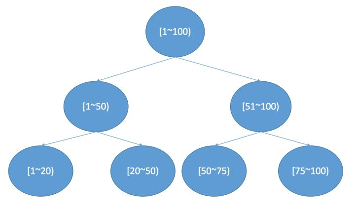

如果是多维，kdtree的建立流程会发生一些变化。
比如我们以二维为例，建立过程如下：

 

1. 确定切分维度，这里维度的选取顺序是数据在这个维度方法最大的维度优先。一个直接的理解就是，数据分散越开的维度，我们优先切分。
2. 切分点的选这个维度最中间的点。
3. 递归进行步骤1，2，我们可以设置一个阈值，点的数目少于多少后就不再切分，直到所有的点都切分好停止。

下图是一个建立例子：

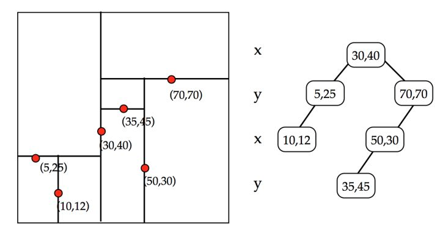

BKDTree是KDTree的变种，因为可以看出来，KDTree如果有新的节点加入，或者节点修改起来，消耗还是比较大。类似于LSM的merge思路，BKD也是多个KDTREE，然后持续merge最终合并成一个。不过我们可以看到如果你某个term类型使用了BKDTree的索引类型，那么在和普通倒排链merge的时候就没那么高效了所以这里要做一个平衡，一种思路是把另一类term也作为一个维度加入BKDTree索引中。

## 如何实现返回结果进行排序聚合

通过之前介绍可以看出lucene通过倒排的存储模型实现term的搜索，那对于有时候我们需要拿到另一个属性的值进行聚合，或者希望返回结果按照另一个属性进行排序。在lucene4之前需要把结果全部拿到再读取原文进行排序，这样效率较低，还比较占用内存，为了加速lucene实现了fieldcache，把读过的field放进内存中。这样可以减少重复的IO，但是也会带来新的问题，就是占用较多内存。新版本的lucene中引入了DocValues，DocValues是一个基于docid的列式存储。当我们拿到一系列的docid后，进行排序就可以使用这个列式存储，结合一个堆排序进行。当然额外的列式存储会占用额外的空间，lucene在建索引的时候可以自行选择是否需要DocValue存储和哪些字段需要存储。

## Lucene的代码目录结构

介绍了lucene中几个主要的数据结构和查找原理后，我们在来看下lucene的代码结构，后续可以深入代码理解细节。lucene的主要有下面几个目录：

 

1. analysis模块主要负责词法分析及语言处理而形成Term。
2. codecs模块主要负责之前提到的一些数据结构的实现，和一些编码压缩算法。包括skiplist，docvalue等。
3. document模块主要包括了lucene各类数据类型的定义实现。
4. index模块主要负责索引的创建，里面有IndexWriter。
5. store模块主要负责索引的读写。
6. search模块主要负责对索引的搜索。
7. geo模块主要为geo查询相关的类实现
8. util模块是bkd，fst等数据结构实现。
   

# 使文本可以被搜索？

在传统的数据库中，一个字段存一个值，但是这对于全文搜索是不足的。想要让文本中的而每个单词都可以被搜索，这意味着数据库需要多个值。

支持一个字段多个值的最佳数据结构是倒排索引。倒排索引包含了出现在所有文档中唯一的值或或词的有序列表，以及每个词所属的文档列表。

倒排索引存储了比包含一个term的文档列表多地多的信息，它可能包含每一个term的文档数量，一个term出现在制定文档中的频次，每个文档中term的顺序，每个文档的长度，所有文档的平均长度等等。这些统计信息让Elasticsearch知道哪些term更重要，哪些文档更重要，也就是相关性。

在全文搜索的早些时候，会为整个文档集合建立一个大索引，并且写入磁盘。只有新索引准备好了它就会替代旧肚饿索引，最近的修改可以被检索。

**不可变性**

写入磁盘的倒排索引是不可变的，它有如下好处：

- 不需要锁。如果从来不需要跟新一个索引，就不必担心多个程序见同时尝试修改。
- 一旦索引被读入文件系统的缓存，它就一直在那儿，因为不会改变。只要文件系统缓存有足够的空间，大部分的读会直接访问内存而不是磁盘。这有助于性能的提升。
- 在索引的声明周期内，所有的其他缓存都可用。他们不需要再每次数据变化了都重建，因此数据不会变。
- 写入单个大的倒排索引，可以压缩数据，较少的磁盘IO和需要缓存索引的大小。

当然，不可变的索引有它的缺点，首先是它不可变。如果想要搜索一个新文档，必须重建整个索引。这不仅限制了一个索引所能装下的数据，还有一个索引可以被更新的频次。

# 准实时索引的实现？

本文主要介绍Elasticsearch的准实时索引的实现，至于基于Lucene的倒排索引将不在这里介绍，有兴趣的读者可以去Lucene的相关文章，或者阅读《Lucene in Action》等书籍。下面将介绍Elasticsearch索引流程中发生的具体操作，重点在于其中的segment、buffer和translog三部分对性能方面的影响。

## 1、动态更新的Lucnee索引

要做到实时跟新条件下数据的可用和可靠，就需要在倒排索引的基础上，再做一系列更高级的处理。总结一下Lucene的处理办法：新收到的数据写入新的索引文件里。Lucene把每次生成的倒排索引，叫做一个段(segment)。然后另外使用一个commit文件，记录索引内的所有segment。而生成segment的数据来源，则是内存中的buffer,也就是说，动态跟新过后过程如下：1）当前磁盘上有三个segement可用，同时有一个commit文件记录当前的segment2）新收到的数据进入内存buffer,索引状态如下所示。3）buffer刷到磁盘，生成一个新的segment,commit文件同步跟新。这样可以完成跟新，也产生了几个问题:1、每次一有数据就刷新到磁盘，会增大对磁盘的操作2、刷新到磁盘的时间占据很大一部分时间3、如果刷新的过程中刷新失败应该怎么控制呢？


## 2、删除和更新

segment是不可变的，所以文档即不能从旧的段中删除，旧的段也不能更新以反映文档最新的文本。相反，每一个提交点包括一个.del文件，包含了段上已经被删除的文档当一个文档被删除，它是实际上只是在.del文件中被标记删除，亦然可以匹配查询，但最终返回之前会被从结果中删除。文档的跟新操作是类似的：当一个文档被更新，旧版本的文档被标记为删除，新版本的文档在新的段中索引。也许该文档的不同版本都会匹配一个查询，但是老版本会从结果中删除。


## 3、利用磁盘缓存实现的准实时检索

既然涉及到磁盘，那么一个不可避免的问题就来了：磁盘太慢了！对我们要求的实时性很高的服务来说，这种处理还不够。所以，在刚刚第3步的处理中，还有一个中间状态:1）内存buffer生成一个新的segment，刷到文件系统缓存中，Lucene即可检索到这个新的segment,索引状态如图所示。2）文件系统缓存真正同步到磁盘上，commit文件跟新。刷到文件系统缓存中这个步骤，Elasticsearch默认1s的时间间隔，这也就是说相当于是实时搜索的，Elasticsearch也提供了单独的/_reflush接口，用户如果对1s间隔还是不太满意，可以主动调用接口来保证搜索可见。

- refresh所有索引 `POST /_refresh `
- 只refresh 索引blogs `/blogs/_refresh `

一般来说我们会通过/_settings接口或者定制template的方式，加大refresh_interval参数：

- 禁用所有自动refresh `PUT /my_logs/_settings{ "refresh_interval": -1 }`
- 每秒自动refresh `PUT /my_logs/_settings{ "refresh_interval": "1s" }`

## 4、translog提供的磁盘同步控制

既然refresh只是写到文件系统缓存中，那么最后一步写到实际磁盘又是由什么来控制的呢？如果这期间发生主机错误、硬盘故障等异常情况，数据会不会丢失？这里，其实Elasticsearch提供了另一个机制来控制。Elasticsearch也把数据写入到内存buffer的同时，其实还另外记录了一个treanslog的日志。也就是说，在内存数据进入到buffer这一步骤时，其实还另外记录了一个translog记录。


相关文档：
https://blog.csdn.net/java_kider/article/details/110112740

https://my.oschina.net/u/4057226/blog/4892096

https://blog.csdn.net/star1210644725/article/details/110675823

https://www.cnblogs.com/koktlzz/p/14303609.html

https://www.cnblogs.com/valor-xh/p/6096072.html