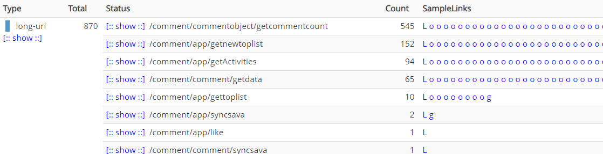

# 服务接口超时问题排查

## 问题现象

凌晨1:35 左右，服务接口大量超时，cat日志埋点显示是redis 操作导致的，持续时间 1:35:31 - 1:35:37，大概6秒，涉及不同机房的机器。

这种短时间的问题，很难查，涉及请求次数大概1200次。

## 问题猜想

1、redis集群问题

2、应用服务器问题

3、网络问题

4、gc导致

5、服务问题

## 问题排查

1、排查了指定时间的redis集群，指标数据正常，没有大幅波动。(排除猜想 1)

2、排查应用服务器cpu和内存等情况，指标正常(排除猜想 2)

3、由于丢包只能按分钟统计，网络暂时无法排查

4、查看gc日志，没有问题

5、问题时间属于低QPS，而且其他时间服务运行正常(排除服务本身问题)

查看cat埋点，发现超时接口只存在于有redis操作逻辑的接口，理论上调用量前几的接口都会超时。

标红的接口未操作redis，前9个中其余接口均有操作redis（均有超时），基本可以确定跟redis 有关。

## 问题解决

由于现在是猜测问题，所以没办法提出一个完美的解决方案。

1、设置redis超时(由于之前设置有问题，导致超时时间未生效)，设置超时后要注意对数据托底

2、每隔一秒循环访问redis(get操作)，确保redis可用性，如果不可用，立刻发送报警消息（起码可以验证是否是redis的问题）

3、如果确认redis连接没问题(网络没问题)，就可能是服务本身的问题，优化代码。

