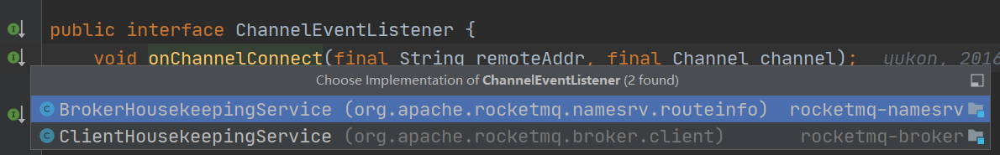

# rocketmq 初探（六）

大家好，我是烤鸭：

&nbsp;&nbsp;&nbsp;&nbsp;上一篇简单介绍部分 NettyRequestProcessor (PullMessageProcessor、QueryMessageProcessor、ReplyMessageProcessor、SendMessageProcessor)，这一篇介绍 ChannelEventListener 。


## ChannelEventListener

```
public interface ChannelEventListener {
    void onChannelConnect(final String remoteAddr, final Channel channel);

    void onChannelClose(final String remoteAddr, final Channel channel);

    void onChannelException(final String remoteAddr, final Channel channel);

    void onChannelIdle(final String remoteAddr, final Channel channel);
}
```

实现有两个类，一个是 nameserver 一个是broker。




### BrokerHousekeepingService

先分析下注册中心的实现，连接成功啥也没干，连接关闭/异常/空闲 都调用了onChannelDestroy方法。

```
public class BrokerHousekeepingService implements ChannelEventListener {
    private static final InternalLogger log = InternalLoggerFactory.getLogger(LoggerName.NAMESRV_LOGGER_NAME);
    private final NamesrvController namesrvController;

    public BrokerHousekeepingService(NamesrvController namesrvController) {
        this.namesrvController = namesrvController;
    }

    @Override
    public void onChannelConnect(String remoteAddr, Channel channel) {
    }

    @Override
    public void onChannelClose(String remoteAddr, Channel channel) {
        this.namesrvController.getRouteInfoManager().onChannelDestroy(remoteAddr, channel);
    }

    @Override
    public void onChannelException(String remoteAddr, Channel channel) {
        this.namesrvController.getRouteInfoManager().onChannelDestroy(remoteAddr, channel);
    }

    @Override
    public void onChannelIdle(String remoteAddr, Channel channel) {
        this.namesrvController.getRouteInfoManager().onChannelDestroy(remoteAddr, channel);
    }
}
```

RouteInfoManager.onChannelDestroy

```
public void onChannelDestroy(String remoteAddr, Channel channel) {
    String brokerAddrFound = null;
    if (channel != null) {
        try {
            try {
                this.lock.readLock().lockInterruptibly();
                Iterator<Entry<String, BrokerLiveInfo>> itBrokerLiveTable =
                    this.brokerLiveTable.entrySet().iterator();
                // 从brokerLiveTable获取当前的broker地址
                while (itBrokerLiveTable.hasNext()) {
                    Entry<String, BrokerLiveInfo> entry = itBrokerLiveTable.next();
                    if (entry.getValue().getChannel() == channel) {
                        brokerAddrFound = entry.getKey();
                        break;
                    }
                }
            } finally {
                this.lock.readLock().unlock();
            }
        } catch (Exception e) {
            log.error("onChannelDestroy Exception", e);
        }
    }
	// 根据channel找不到的话，会以 remoteAddr为准
    if (null == brokerAddrFound) {
        brokerAddrFound = remoteAddr;
    } else {
        log.info("the broker's channel destroyed, {}, clean it's data structure at once", brokerAddrFound);
    }

    if (brokerAddrFound != null && brokerAddrFound.length() > 0) {

        try {
            try {
            	// 加写锁，当前broker列表和过滤列表移除该地址
                this.lock.writeLock().lockInterruptibly();
                this.brokerLiveTable.remove(brokerAddrFound);
                this.filterServerTable.remove(brokerAddrFound);
                String brokerNameFound = null;
                boolean removeBrokerName = false;
                // 从broker地址列表的brokerData的addrs移除该地址
                Iterator<Entry<String, BrokerData>> itBrokerAddrTable =
                    this.brokerAddrTable.entrySet().iterator();
                while (itBrokerAddrTable.hasNext() && (null == brokerNameFound)) {
                    BrokerData brokerData = itBrokerAddrTable.next().getValue();

                    Iterator<Entry<Long, String>> it = brokerData.getBrokerAddrs().entrySet().iterator();
                    while (it.hasNext()) {
                        Entry<Long, String> entry = it.next();
                        Long brokerId = entry.getKey();
                        String brokerAddr = entry.getValue();
                        if (brokerAddr.equals(brokerAddrFound)) {
                            brokerNameFound = brokerData.getBrokerName();
                            it.remove();
                            log.info("remove brokerAddr[{}, {}] from brokerAddrTable, because channel destroyed",
                                brokerId, brokerAddr);
                            break;
                        }
                    }
					// 如果 brokerData的addrs空的话，删除该 brokerData
                    if (brokerData.getBrokerAddrs().isEmpty()) {
                        removeBrokerName = true;
                        itBrokerAddrTable.remove();
                        log.info("remove brokerName[{}] from brokerAddrTable, because channel destroyed",
                            brokerData.getBrokerName());
                    }
                }
				// clusterAddrTable 集群列表移除该地址
                if (brokerNameFound != null && removeBrokerName) {
                    Iterator<Entry<String, Set<String>>> it = this.clusterAddrTable.entrySet().iterator();
                    while (it.hasNext()) {
                        Entry<String, Set<String>> entry = it.next();
                        String clusterName = entry.getKey();
                        Set<String> brokerNames = entry.getValue();
                        boolean removed = brokerNames.remove(brokerNameFound);
                        if (removed) {
                            log.info("remove brokerName[{}], clusterName[{}] from clusterAddrTable, because channel destroyed",
                                brokerNameFound, clusterName);

                            if (brokerNames.isEmpty()) {
                                log.info("remove the clusterName[{}] from clusterAddrTable, because channel destroyed and no broker in this cluster",
                                    clusterName);
                                it.remove();
                            }

                            break;
                        }
                    }
                }
				// topicQueueTable 移除该地址
                if (removeBrokerName) {
                    Iterator<Entry<String, List<QueueData>>> itTopicQueueTable =
                        this.topicQueueTable.entrySet().iterator();
                    while (itTopicQueueTable.hasNext()) {
                        Entry<String, List<QueueData>> entry = itTopicQueueTable.next();
                        String topic = entry.getKey();
                        List<QueueData> queueDataList = entry.getValue();

                        Iterator<QueueData> itQueueData = queueDataList.iterator();
                        while (itQueueData.hasNext()) {
                            QueueData queueData = itQueueData.next();
                            if (queueData.getBrokerName().equals(brokerNameFound)) {
                                itQueueData.remove();
                                log.info("remove topic[{} {}], from topicQueueTable, because channel destroyed",
                                    topic, queueData);
                            }
                        }

                        if (queueDataList.isEmpty()) {
                            itTopicQueueTable.remove();
                            log.info("remove topic[{}] all queue, from topicQueueTable, because channel destroyed",
                                topic);
                        }
                    }
                }
            } finally {
                this.lock.writeLock().unlock();
            }
        } catch (Exception e) {
            log.error("onChannelDestroy Exception", e);
        }
    }
}
```

### ClientHousekeepingService

连接成功啥也没干，连接关闭/异常/空闲 都调用了不同manager.doChannelCloseEvent方法。

```
public class ClientHousekeepingService implements ChannelEventListener {
    private static final InternalLogger log = InternalLoggerFactory.getLogger(LoggerName.BROKER_LOGGER_NAME);
    private final BrokerController brokerController;

    private ScheduledExecutorService scheduledExecutorService = Executors
        .newSingleThreadScheduledExecutor(new ThreadFactoryImpl("ClientHousekeepingScheduledThread"));

    public ClientHousekeepingService(final BrokerController brokerController) {
        this.brokerController = brokerController;
    }
	// brokerController.start()
    public void start() {

        this.scheduledExecutorService.scheduleAtFixedRate(new Runnable() {
            @Override
            public void run() {
                try {
                	// 扫描不活跃的链接并移除
                    ClientHousekeepingService.this.scanExceptionChannel();
                } catch (Throwable e) {
                    log.error("Error occurred when scan not active client channels.", e);
                }
            }
        }, 1000 * 10, 1000 * 10, TimeUnit.MILLISECONDS);
    }

    private void scanExceptionChannel() {
        this.brokerController.getProducerManager().scanNotActiveChannel();
        this.brokerController.getConsumerManager().scanNotActiveChannel();
        this.brokerController.getFilterServerManager().scanNotActiveChannel();
    }

    public void shutdown() {
        this.scheduledExecutorService.shutdown();
    }

    @Override
    public void onChannelConnect(String remoteAddr, Channel channel) {

    }

    @Override
    public void onChannelClose(String remoteAddr, Channel channel) {
        this.brokerController.getProducerManager().doChannelCloseEvent(remoteAddr, channel);
        this.brokerController.getConsumerManager().doChannelCloseEvent(remoteAddr, channel);
        this.brokerController.getFilterServerManager().doChannelCloseEvent(remoteAddr, channel);
    }

    @Override
    public void onChannelException(String remoteAddr, Channel channel) {
        this.brokerController.getProducerManager().doChannelCloseEvent(remoteAddr, channel);
        this.brokerController.getConsumerManager().doChannelCloseEvent(remoteAddr, channel);
        this.brokerController.getFilterServerManager().doChannelCloseEvent(remoteAddr, channel);
    }

    @Override
    public void onChannelIdle(String remoteAddr, Channel channel) {
        this.brokerController.getProducerManager().doChannelCloseEvent(remoteAddr, channel);
        this.brokerController.getConsumerManager().doChannelCloseEvent(remoteAddr, channel);
        this.brokerController.getFilterServerManager().doChannelCloseEvent(remoteAddr, channel);
    }
}
```

ProducerManager.doChannelCloseEvent

```
public synchronized void doChannelCloseEvent(final String remoteAddr, final Channel channel) {
    if (channel != null) {
    	// groupChannelTable的clientChannelInfoTable 移除对应的channel(关联关系是在producer发送心跳时注册的)
        for (final Map.Entry<String, ConcurrentHashMap<Channel, ClientChannelInfo>> entry : this.groupChannelTable
                .entrySet()) {
            final String group = entry.getKey();
            final ConcurrentHashMap<Channel, ClientChannelInfo> clientChannelInfoTable =
                    entry.getValue();
            // clientChannelTable 移除对应的channel(关联关系是在producer发送心跳时注册的)
            final ClientChannelInfo clientChannelInfo =
                    clientChannelInfoTable.remove(channel);
            if (clientChannelInfo != null) {
                clientChannelTable.remove(clientChannelInfo.getClientId());
                log.info(
                        "NETTY EVENT: remove channel[{}][{}] from ProducerManager groupChannelTable, producer group: {}",
                        clientChannelInfo.toString(), remoteAddr, group);
            }

        }
    }
}
```

ConsumerManager.doChannelCloseEvent

```
public void doChannelCloseEvent(final String remoteAddr, final Channel channel) {
    Iterator<Entry<String, ConsumerGroupInfo>> it = this.consumerTable.entrySet().iterator();
    while (it.hasNext()) {
        Entry<String, ConsumerGroupInfo> next = it.next();
        ConsumerGroupInfo info = next.getValue();
        // consumerTable的channelInfoTable(value) 移除对应的channel(关联关系是在consumer注册时put)
        boolean removed = info.doChannelCloseEvent(remoteAddr, channel);
        if (removed) {
            if (info.getChannelInfoTable().isEmpty()) {
            	// consumerTable 移除对应的group(关联关系是在consumer注册时put)
                ConsumerGroupInfo remove = this.consumerTable.remove(next.getKey());
                if (remove != null) {
                    log.info("unregister consumer ok, no any connection, and remove consumer group, {}",
                        next.getKey());
                    // 触发consumerIdsChange的unregister事件
                    this.consumerIdsChangeListener.handle(ConsumerGroupEvent.UNREGISTER, next.getKey());
                }
            }
			// 触发consumerIdsChange的change事件
            this.consumerIdsChangeListener.handle(ConsumerGroupEvent.CHANGE, next.getKey(), info.getAllChannel());
        }
    }
}
```

```
public boolean doChannelCloseEvent(final String remoteAddr, final Channel channel) {
    final ClientChannelInfo info = this.channelInfoTable.remove(channel);
    if (info != null) {
        log.warn(
            "NETTY EVENT: remove not active channel[{}] from ConsumerGroupInfo groupChannelTable, consumer group: {}",
            info.toString(), groupName);
        return true;
    }

    return false;
}
```

DefaultConsumerIdsChangeListener.handle

```
@Override
public void handle(ConsumerGroupEvent event, String group, Object... args) {
    if (event == null) {
        return;
    }
    switch (event) {
        case CHANGE:
            if (args == null || args.length < 1) {
                return;
            }
            List<Channel> channels = (List<Channel>) args[0];
            // 开启consumerIdsChange的change事件通知开关
            if (channels != null && brokerController.getBrokerConfig().isNotifyConsumerIdsChangedEnable()) {
                for (Channel chl : channels) {
                    this.brokerController.getBroker2Client().notifyConsumerIdsChanged(chl, group);
                }
            }
            break;
        case UNREGISTER:
        	// 更新 filterDataByTopic的FilterDataMapByTopic 的deadTime
            this.brokerController.getConsumerFilterManager().unRegister(group);
            break;
        case REGISTER:
            if (args == null || args.length < 1) {
                return;
            }
            Collection<SubscriptionData> subscriptionDataList = (Collection<SubscriptionData>) args[0];
            this.brokerController.getConsumerFilterManager().register(group, subscriptionDataList);
            break;
        default:
            throw new RuntimeException("Unknown event " + event);
    }
}
```

Broker2Client.notifyConsumerIdsChanged

```
public void notifyConsumerIdsChanged(
    final Channel channel,
    final String consumerGroup) {
    if (null == consumerGroup) {
        log.error("notifyConsumerIdsChanged consumerGroup is null");
        return;
    }

    NotifyConsumerIdsChangedRequestHeader requestHeader = new NotifyConsumerIdsChangedRequestHeader();
    requestHeader.setConsumerGroup(consumerGroup);
    RemotingCommand request =
        RemotingCommand.createRequestCommand(RequestCode.NOTIFY_CONSUMER_IDS_CHANGED, requestHeader);

    try {
    	// 发送单向请求 —> ClientRemotingProcessor.processRequest ,触发客户端的立即rebalance(正常是每20s执行一次rebalance)
        this.brokerController.getRemotingServer().invokeOneway(channel, request, 10);
    } catch (Exception e) {
        log.error("notifyConsumerIdsChanged exception. group={}, error={}", consumerGroup, e.toString());
    }
}
```

FilterServerManager.doChannelCloseEvent

```
public void doChannelCloseEvent(final String remoteAddr, final Channel channel) {
	// filterServerTable 移除对应的channel
    FilterServerInfo old = this.filterServerTable.remove(channel);
    if (old != null) {
        log.warn("The Filter Server<{}> connection<{}> closed, remove it", old.getFilterServerAddr(),
            remoteAddr);
    }
}
```


## 小结 

```
    private final HashMap<String/* topic */, List<QueueData>> topicQueueTable;
    private final HashMap<String/* brokerName */, BrokerData> brokerAddrTable;
    private final HashMap<String/* clusterName */, Set<String/* brokerName */>> clusterAddrTable;
    private final HashMap<String/* brokerAddr */, BrokerLiveInfo> brokerLiveTable;
    private final HashMap<String/* brokerAddr */, List<String>/* Filter Server */> filterServerTable;
```

ChannelEventListener的实现有2个，BrokerHousekeepingService和ClientHousekeepingService。

### BrokerHousekeepingService

注册中心的BrokerHousekeepingService在 连接关闭/异常/空闲 都调用了onChannelDestroy方法。

onChannelDestroy：获取该channel的addr，brokerLiveTable/filterServerTable 移除该addr。

brokerAddrTable的BrokerData获取brokerName，并brokerAddrs 移除该addr。

clusterAddrTable移除该brokerName。

topicQueueTable的List<QueueData>移除该brokerName。

### ClientHousekeepingService

broker的client的ClientHousekeepingService在 连接关闭/异常/空闲 都调用了不同manager.doChannelCloseEvent方法。

- ProducerManager.doChannelCloseEvent：groupChannelTable的clientChannelInfoTable 移除对应的channel(关联关系是在producer发送心跳时注册的)
  clientChannelTable 移除对应的channel(关联关系是在producer发送心跳时注册的)

- ConsumerManager.doChannelCloseEvent：consumerTable移除对应的group， channelInfoTable移除对应的channel。

  触发consumerIdsChangeListener的unregister/change事件。

  unregister：更新groupFilterData的ConsumerFilterData的deadTime。

  change：如果开启消费端通知，通知consumer立即rebalance。

- FilterServerManager.doChannelCloseEvent：filterServerTable 移除对应的channel


