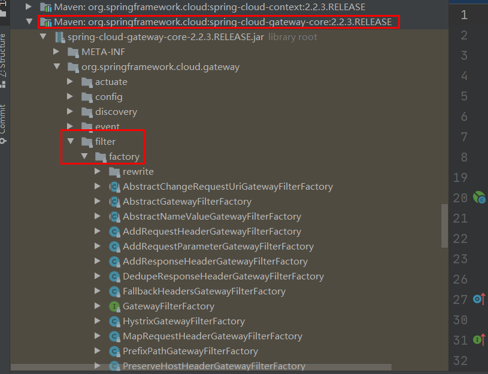
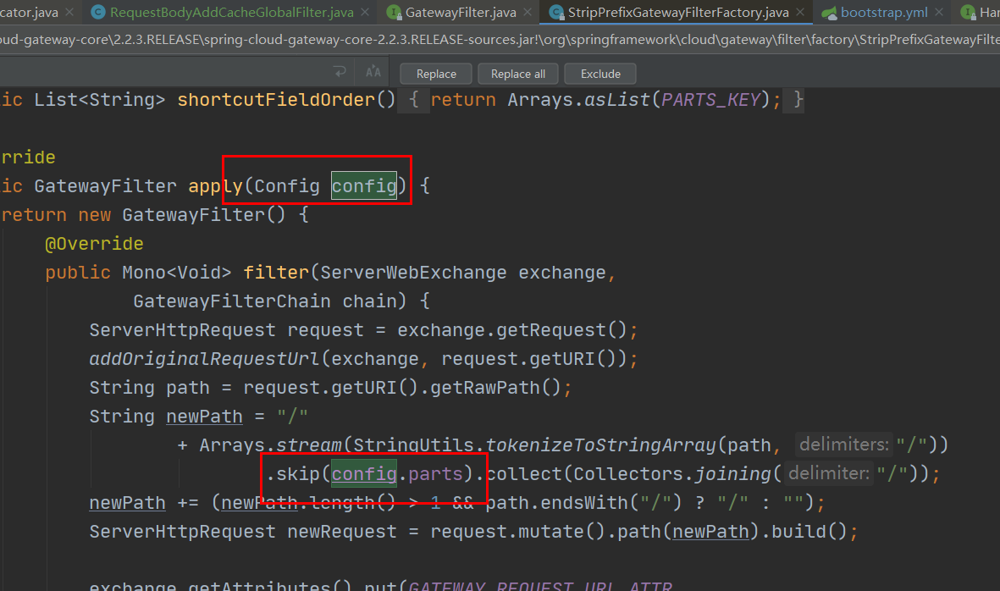
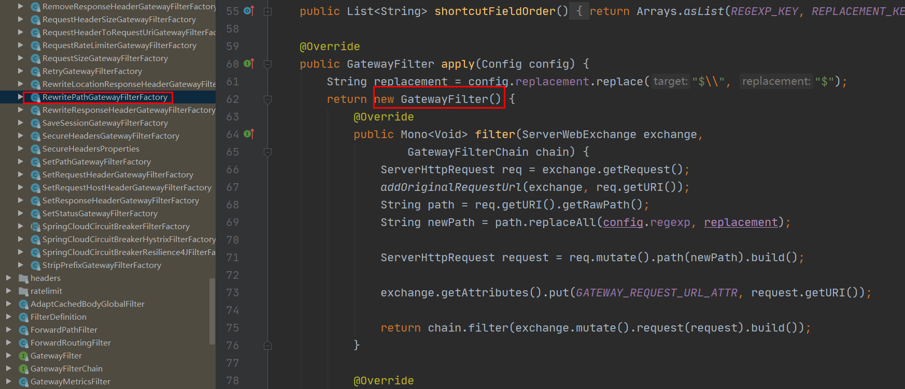
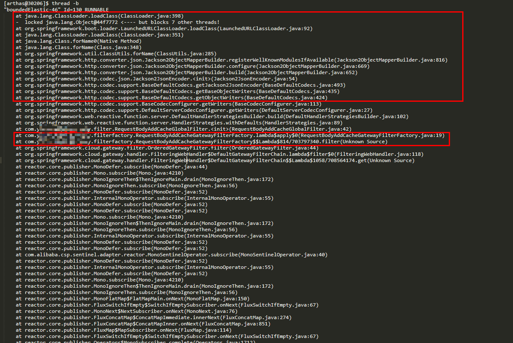
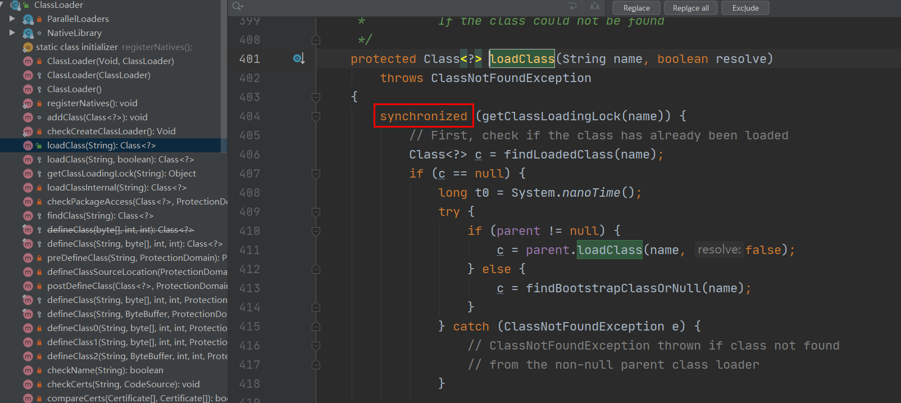
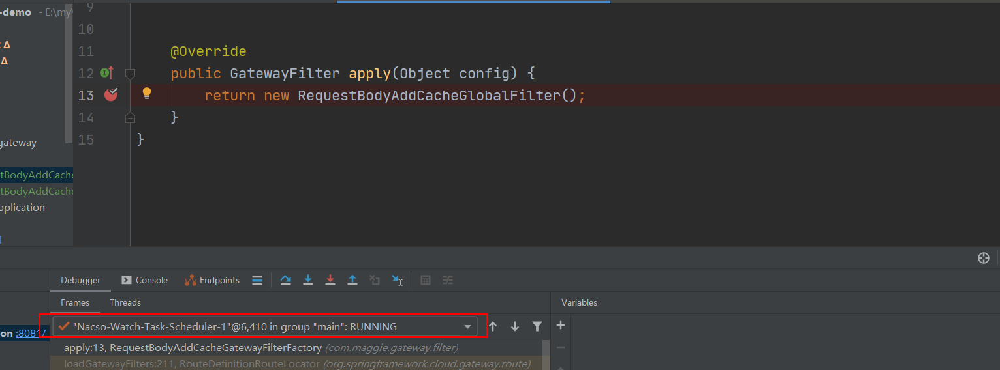
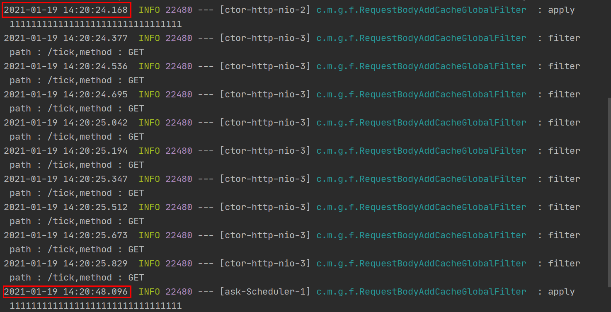

# springcloud gateway 使用nacos 动态过滤器 记一次线上网关升级cpu升高的问题

大家好，我是烤鸭：

​	网关升级，想使用 springcloud gateway nacos 动态过滤器配置(原来是硬编码的方式)，升级之后出了一些问题(cpu升高，ygc频繁)，记录一下。

关于 springcloud gateway 集成 nacos  可以看这篇。

https://blog.csdn.net/Angry_Mills/article/details/108821602

springcloud gateway 源码解析、请求响应流程 可以看这篇。

https://blog.csdn.net/Angry_Mills/article/details/109035426

# pom

父pom

    <dependencyManagement>
        <dependencies>
            <dependency>
                <groupId>org.springframework.cloud</groupId>
                <artifactId>spring-cloud-dependencies</artifactId>
                <version>${spring-cloud.version}</version>
                <type>pom</type>
                <scope>import</scope>
            </dependency>
    
            <dependency>
                <groupId>com.alibaba.cloud</groupId>
                <artifactId>spring-cloud-alibaba-dependencies</artifactId>
                <version>${springcloud-alibaba.version}</version>
                <type>pom</type>
                <scope>import</scope>
            </dependency>
        </dependencies>
    </dependencyManagement>
gateway pom

```
<!--springcloud 组件start -->
<dependency>
	<groupId>org.springframework.cloud</groupId>
	<artifactId>spring-cloud-starter-gateway</artifactId>
</dependency>
<!-- nacos组件 -->
<dependency>
   <groupId>com.alibaba.cloud</groupId>
   <artifactId>spring-cloud-starter-alibaba-nacos-config</artifactId>
</dependency>
```


## 配置文件

springcloud gateway 支持配置文件 filters，RequestBodyAddCache为自定义过滤器，这里注意filters 的编写顺序和实际过滤的顺序一样。

```
spring:
  application:
    name: gateway
  cloud:
    gateway:
      routes:
        - id: tick-route
          filters:
            - RequestBodyAddCache
            - StripPrefix=1
          predicates:
            - name: Path
              args[pattern]: /tick/**
          uri: lb://demo-tick
        - id: tick-route
          filters:
            - StripPrefix=1
          predicates:
            - name: Path
              args[pattern]: /dick/**
          uri: lb://demo-dick
    nacos:
      discovery:
        server-addr: localhost:8848
      password: nacos
      username: nacos
```

默认自带的有哪些过滤器：



常用的像：StripPrefix、RewritePath

还可以传入参数，会封装到 config对象里，创建过滤器时使用。



StripPrefix -> StripPrefixGatewayFilterFactory

RewritePath -> RewritePathGatewayFilterFactory

发现一点规律么，只要我们也按照这个方式写一个工厂就可以，像这样

RewritePathGatewayFilterFactory




## 过滤器类

这个过滤器的目的是 获取请求路径和请求方式

RequestBodyAddCacheGlobalFilter

```
package com.maggie.gateway.filter;

import org.slf4j.Logger;
import org.slf4j.LoggerFactory;
import org.springframework.cloud.gateway.filter.GatewayFilter;
import org.springframework.cloud.gateway.filter.GatewayFilterChain;
import org.springframework.core.Ordered;
import org.springframework.http.HttpMethod;
import org.springframework.http.codec.HttpMessageReader;
import org.springframework.http.server.reactive.ServerHttpRequest;
import org.springframework.web.reactive.function.server.HandlerStrategies;
import org.springframework.web.reactive.function.server.ServerRequest;
import org.springframework.web.server.ServerWebExchange;
import reactor.core.publisher.Mono;

import java.util.List;

public class RequestBodyAddCacheGlobalFilter implements GatewayFilter, Ordered {
    private Logger logger = LoggerFactory.getLogger(RequestBodyAddCacheGlobalFilter.class);
    
    private final List<HttpMessageReader<?>> messageReaders = HandlerStrategies.withDefaults().messageReaders();
    
    @Override
    public Mono<Void> filter(ServerWebExchange exchange, GatewayFilterChain chain) {
        ServerHttpRequest serverHttpRequest = exchange.getRequest();
        ServerRequest serverRequest = ServerRequest.create(exchange, messageReaders);
        String path = serverHttpRequest.getPath().value();
        HttpMethod method = serverHttpRequest.getMethod();
        // 打印请求路径和请求方式
        logger.info("filter path : {},method : {}", path, method);
        return chain.filter(exchange);
    }
    
    @Override
    public int getOrder() {
        return 0;
    }
    
}
```

RequestBodyAddCacheGatewayFilterFactory

```
package com.maggie.gateway.filter;

import org.springframework.cloud.gateway.filter.GatewayFilter;
import org.springframework.cloud.gateway.filter.factory.AbstractGatewayFilterFactory;
import org.springframework.stereotype.Component;

@Component
public class RequestBodyAddCacheGatewayFilterFactory extends AbstractGatewayFilterFactory {
    
    
    @Override
    public GatewayFilter apply(Object config) {
        return new RequestBodyAddCacheGlobalFilter();
    }
}
```

## 问题(cpu 升高)

但是这种方式升级之后，线上网关的cpu消耗差不多是之前的两倍。

后来在测试环境压测发现了问题源头，artas 查看线程阻塞。



就是 RequestBodyAddCacheGlobalFilter 里的成员变量 messageReaders 阻塞了。

查了下源码，HandlerStrategies.withDefaults() 的时候 ServerCodecConfigurer codecConfigurer 会初始化Jackson2JsonEncoder ->ClassUtils.forName("com.fasterxml.jackson.datatype.jdk8.Jdk8Module") -> Classloader.loadClass() 有锁



为啥之前没有问题呢？

原来的 RequestBodyAddCacheGlobalFilter 是@Autowired(单例的)，按照上面的改后变成每次触发apply方法都会创建一个RequestBodyAddCacheGlobalFilter 对象。

每次创建对象其实也没有问题，源码里的工厂类都是new GatewayFilter()。（上面 StripPrefixGatewayFilterFactory 和 RewritePathGatewayFilterFactory 源码的图）

还有一个疑问就是 RequestBodyAddCacheGatewayFilterFactory.apply() 方法理论上只会项目启动调用一次，不会创建多个对象。

其实不管是 eurka 或者 nacos 或者 apollo 会触发 AbstractApplicationContext.refresh

而nacos（Watch-task 线程） NacosWatch.nacosServicesWatch( this.publisher.publishEvent )

eurka (DiscoveryClient-CacheRefresh 线程) CloudEurekaClient.onCacheRefreshed( this.publisher.publishEvent )



下图可以看出频繁访问并不会触发apply方法，apply方法是在固定的周期触发。(触发次数取决于拦截器配置的次数，比如几个route配置了这个filter，就会初始化几次，线上的route比较多，每次都会初始化十几次，所以cpu变化也比较明显)



## 解决方式

跟原来一样，RequestBodyAddCacheGlobalFilter 采用单例，注入进来就行。不会创建多余的对象。cpu和ygc恢复了。

```
@Component
public class RequestBodyAddCacheGatewayFilterFactory extends AbstractGatewayFilterFactory {

    @Autowired
    RequestBodyAddCacheGlobalFilter requestBodyAddCacheGlobalFilter;

    @Override
    public GatewayFilter apply(Object config) {
        return requestBodyAddCacheGlobalFilter;
    }
}
```