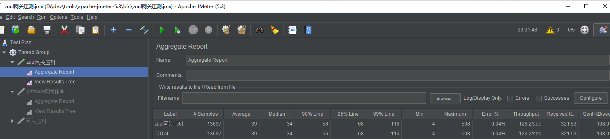
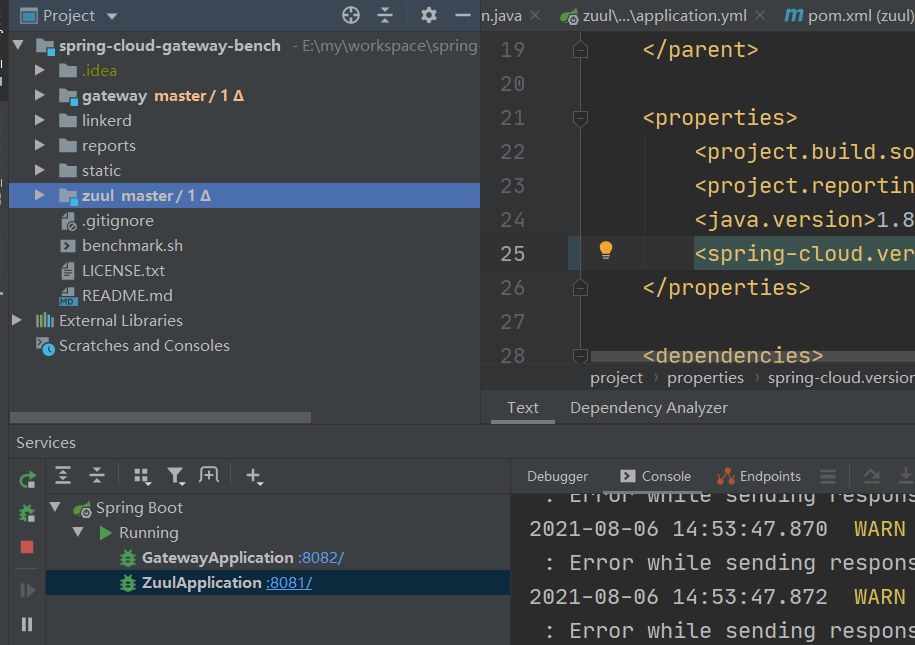
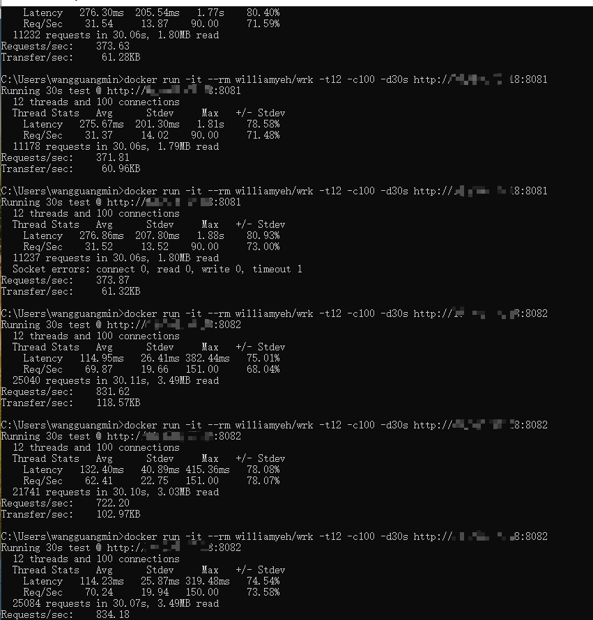

# zuul 1.x 和gateway对比

&nbsp;&nbsp;&nbsp;&nbsp;大家好，我是烤鸭：
&nbsp;&nbsp;&nbsp;&nbsp;&nbsp;&nbsp;&nbsp;&nbsp;今天分享下 zuul和gateway 网关压测。


## 环境：

windows 10

jdk 8


## 压测工具：

wrk

jmeter


## 数据对比

场景是仅单独转发，接口 Thread.sleep(50)

### jmeter 12 线程，30s

zuul：



gateway：


用jmeter 压测完发现两种网关性能差不多，本来以为 sc gateway 用netty 性能应该更好才对。

考虑到有可能是使用姿势有问题， 毕竟官方说性能提升50%。

官方对比的demo：

https://github.com/spencergibb/spring-cloud-gateway-bench

下载下来启动官方的demo，zuul和gateway，这里还要吐槽一下，gateway项目起不来，需要把 spring-cloud.version 的snapshot改成 Greenwich.RELEASE



## wrk 12线程 100 连接 30s

wrk github : https://github.com/wg/wrk

windows 也没办法直接用wrk，放到docker里跑的。

```
docker pull williamyeh/wrk
docker run -it --rm williamyeh/wrk -t12 -c100 -d30s http://168.0.0.1:8081
docker run -it --rm williamyeh/wrk -t12 -c100 -d30s http://168.0.0.1:8082
```

第一次压的时候，sc gateway 性能差不多是 zuul的2倍，为了避免误差，多压了几次，取个平稳值。



sc gateway 性能差不多是zuul的两倍，感觉还是有误差，中间测试的时候，sc gateway 也有比zuul 强20%的时候。

zuul 平均 370，gateway 平均800

## 总结

总得来说，sc gateway 在某些场景下性能是优于zuul 1.x的(这是肯定的，一个异步io，一个同步)，不知道为啥 jmeter 和wrk 测试的差距这么大，可能还是哪没调试对。

